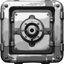

<div align="center">



<h2>Cardavault</h2>

<p>A POC to evaluate and estimate the time and effort to build a cardano wallet using Dolos and CSL (asmjs)</p>

<p align="center">
  <a href="https://github.com/studiowebux/cardavault/issues">Report Bug</a>
  ·
  <a href="https://github.com/studiowebux/cardavault/issues">Request Feature</a>
</p>
</div>

---

## About

This is only a POC, I will probably not continue this project.

- Frontend is not done (I started something but abandonned quickly)
- Wallet and keys are hardcoded
- Integrated with Anvil API (Preprod)
- Tested Full implementation with Weld (create tx, sign tx and submit worked with success)
- Current extension size is 21.8 MB
- You need a dolos node to fetch the UTXOs and compute the balance

**Environments**

- `DOLOS_URL`
- `X_API_KEY`

---

## Usage

```bash
deno task build
```

then load the `dist/` in chrome browser extension

**Terminal #1**

```bash
cd __tests__
deno run -A --env-file=../.env client.ts
```

**Terminal #2**

```bash
cd provider
deno run -A --env-file=../.env server.ts
```

---

## License

Distributed under the MIT License. See LICENSE for more information.

## Contact

- Tommy Gingras @ tommy@studiowebux.com | Studio Webux

---

<div>
<b> | </b>
<a href="https://www.buymeacoffee.com/studiowebux" target="_blank"
      ></a>
<b> | </b>
<a href="https://webuxlab.com" target="_blank"
      > Webux Lab</a>
<b> | </b>
</div>

---